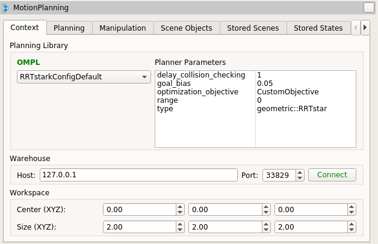
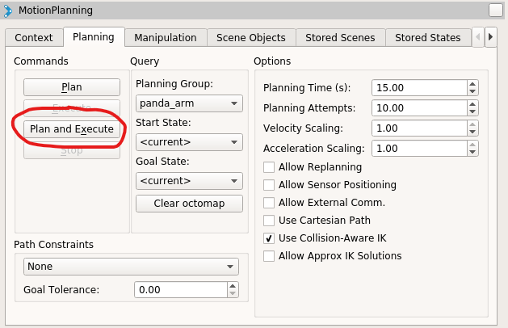

# Tutorial on using custom cost servers with OMPL in ROS

To get started with the tools you can launch [the Panda demo provided by MoveIt! using RViz](http://docs.ros.org/kinetic/api/moveit_tutorials/html/doc/quickstart_in_rviz/quickstart_in_rviz_tutorial.html).

Go ahead and walk through all the steps if you’re unfamiliar with MoveIt! and Rviz. Once you’re comfortable with it, come back here and let’s test our custom objective setup.

To run our custom objective we need to select the RRT* (RRTstarkConfigDefault) planner from the drop down in the MotionPlanning pane. It should like this:



Now click on the Planning tab and then select Plan and Execute (note that your robot must have different start and goal positions for anything to happen). See below:



Now if you go back to the terminal in which you ran the roslaunch command above, you should notice a bunch of warning messages saying something like:

```
[ WARN] [1572387284.914557300]: Failed to call service custom_cost. Using clearance instead.
```

This is because we haven’t started a ROS server that is ready to send out costs to OMPL. Since OMPL can’t find the server, it simply defaults to checking the clearance as the cost function for each state.

In order to start our ROS cost server, we can simply launch it using the rosrun command from another terminal (assuming the ROS master node is still running from our roslaunch command):

```
rosrun ompl_cost_server_demos random_cost.py
```

The above command runs the server we showed the code for above. This server simply publishes random values for the cost to OMPL.

Now that we have that running, go back to rviz and move the start and goal positions of the arm. Once that is done, click Plan and Execute again to make OMPL attempt to find a solution.

If all worked correctly you should see something like the following output from the server node:

```
[INFO] [1572387558.281799]: Returning cost: 0.743727
```

This means that OMPL is asking your server for the cost of different states and everything is working!